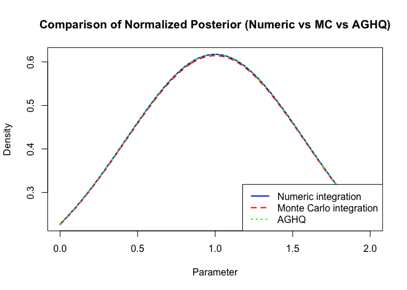
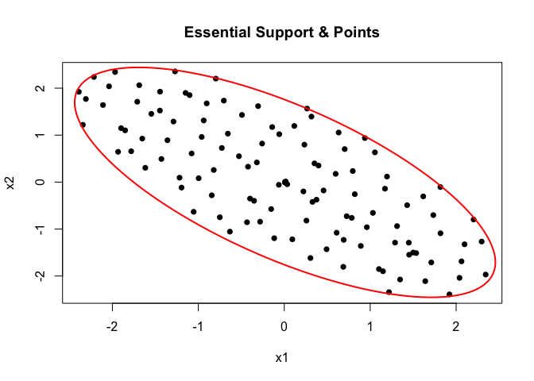
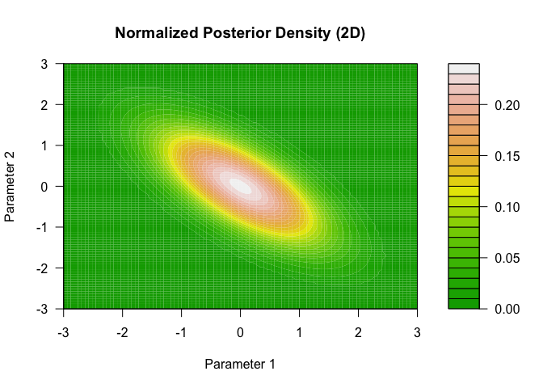

<!-- README.md is generated from README.Rmd. Please edit that file -->

# BOSS

<!-- badges: start -->

<!-- badges: end -->

The goal of BOSS is to perform scalable approximate Bayesian inference
for complex hierarchical models, with a (log) marginal likelihood that
is intractable and/or expensive to compute.

## Installation

You can install the development version of BOSS from
[GitHub](https://github.com/) with:

``` r
# install.packages("pak")
pak::pak("davidolohowski/BOSS")
```

## Example

This is a basic example which shows you how to solve a simple problem in
1-D.

Assume the true (log) marginal likelihood is given by the following
sinusoidal function:

``` r
library(BOSS)
f1d <- function(x) sin(0.5*pi*x)
```

We can use the `boss` function to approximate the (log) marginal
likelihood of this function, specifying the objective function, the
dimension of the problem, and the bounds for the BO optimization. The
`alpha` parameter controls the level of the essential support, while `h`
controls the target fill-in distance of the design points.

``` r
# A automatic implementation
br <- boss(f1d, D = 1, method = 'modal',
            modal_opts = list(lower = 0, upper = 2),
            alpha = 0.05, h = 0.1, verbose = 1)
#> Stage 1: Bayesian Optimization via Mode-Seeking Surrogate (BOSS) started.
#> Stage 1: BOSS finished.
#> Total time taken: 0.81 seconds.
#> Start updating Hessian at the mode...
#> Hessian updated in  0.02  seconds.
#> Stage 2: Fill-in to target spacing h =  0.1 
#> fill in: added 17 point(s).
#> Warning in (function (boss_result, h, max_add = 100, n_sample_max = 10000, :
#> Updated fill-in distance is (0.104862) > target h (0.100000); Adjust your
#> expectation by either increasing max_add and n_sample_max or increasing h.
#> Final update completed in  0.09  seconds.

plot(br)
```


For more advanced applications, the user can also manually perform each
step of the BOSS algorithm, as shown below:

``` r
# A manual implementation
br <- BOSS_modal(func = f1d, D = 1,
                        lower = 0, upper = 2,
                        update_step = 5,
                        quad = FALSE,
                        max_iter = 20,
                        verbose = 1)
#> Stage 1: Bayesian Optimization via Mode-Seeking Surrogate (BOSS) started.
#> Stage 1: BOSS finished.
#> Total time taken: 0.43 seconds.

br <- update_hessian(br)
br <- compute_essential_support(br, alpha=0.05)
br <- construct_essential_designs(br)
br <- compute_fill_in(br)
br <- fill_in(br, h = 0.1, verbose = 1, max_add = 100)
#> fill in: added 16 point(s).
br_update <- update_boss(br)
plot(br_update)
```


Take a look at the normalized posterior:

``` r
br1 <- get_normalized_posterior(br_update, int_method = "mc", nsamples = 10000)
br2 <- get_normalized_posterior(br_update, int_method = "numeric")
br3 <- get_normalized_posterior(br_update, int_method = "aghq", aghq_K = 10)
```

``` r
# Define grid
x_vals <- seq(0, 2, length.out = 300)

# Evaluate both posteriors
post_mc <- sapply(x_vals, br1$normalized_posterior)
post_num <- sapply(x_vals, br2$normalized_posterior)
post_aghq <- sapply(x_vals, br3$normalized_posterior)

# Plot
plot(
  x_vals, post_num, type = "l", lwd = 2, col = "blue",
  xlab = "Parameter", ylab = "Density",
  main = "Comparison of Normalized Posterior (Numeric vs MC vs AGHQ)"
)
lines(x_vals, post_mc, col = "red", lwd = 2, lty = 2)
lines(x_vals, post_aghq, col = "green", lwd = 2, lty = 3)
legend(
  "bottomright",
  legend = c("Numeric integration", "Monte Carlo integration", "AGHQ"),
  col = c("blue", "red", "green"), lty = c(1, 2, 3), lwd = 2
)
```



## 2-D Example

Test the BOSS algorithm on a 2-D Gaussian density. The objective
function here is the log-density of a randomly generated bivariate
Gaussian random variable.

``` r
set.seed(1234)
rho <- runif(1, min = -0.9, 0.9)
f2d <- function(x) mvtnorm::dmvnorm(x, rep(0,2), sigma = matrix(c(1,rho, rho, 1), 2, 2), log = T)

# A automatic implementation
br3 <- boss(f2d, D = 2, method = 'modal',
            modal_opts = list(lower = -c(3,3), upper = c(3,3)),
            alpha = 0.05, h = 0.1, verbose = 1)
#> Stage 1: Bayesian Optimization via Mode-Seeking Surrogate (BOSS) started.
#> Stage 1: BOSS finished.
#> Total time taken: 0.94 seconds.
#> Start updating Hessian at the mode...
#> Hessian updated in  0.03  seconds.
#> Stage 2: Fill-in to target spacing h =  0.1
#> Warning in (function (boss_result, h, max_add = 100, n_sample_max = 10000, :
#> Number of points to be added is greater than max_add. Required h may not be
#> achieved.
#> fill in: added 100 point(s).
#> Warning in (function (boss_result, h, max_add = 100, n_sample_max = 10000, :
#> Updated fill-in distance is (0.446202) > target h (0.100000); Adjust your
#> expectation by either increasing max_add and n_sample_max or increasing h.
#> Final update completed in  0.55  seconds.
plot(br3)
```


``` r

f2d(c(1,1))
#> [1] -4.789829
br3$surrogate(c(1,1))
#> [1] -4.7833
```

Similarly, users can also have more modular control over the procedure:

``` r
br3 <- BOSS_modal(func = f2d, D = 2,
                        lower = -c(3,3), upper = c(3,3),
                        initial_design = 10,
                        quad = F,
                        update_step = 10,
                        max_iter = 100,
                        verbose = 1)
#> Stage 1: Bayesian Optimization via Mode-Seeking Surrogate (BOSS) started.
#> Stage 1: BOSS finished.
#> Total time taken: 1.06 seconds.

br3 <- update_hessian(br3)
br3 <- compute_essential_support(br3, alpha = 0.05)
br3 <- construct_essential_designs(br3)
br3 <- compute_fill_in(br3, n_samples = 100000)
br3 <- fill_in(br3, h = 0.1, max_add = 100)
#> Warning in fill_in(br3, h = 0.1, max_add = 100): Number of points to be added
#> is greater than max_add. Required h may not be achieved.
#> Warning in fill_in(br3, h = 0.1, max_add = 100): Updated fill-in distance is
#> (0.439869) > target h (0.100000); Adjust your expectation by either increasing
#> max_add and n_sample_max or increasing h.
plot(br3)
```



``` r

br3_update <- update_boss(br3)
br3_update$surrogate(c(1,1))
#> [1] -4.784129
```

The posterior can be computed as before:

``` r
br3_update <- get_normalized_posterior(br3_update, int_method = "mc", nsamples = 10000)
```

``` r
# plot the posterior
x_seq <- seq(-3, 3, length.out = 100)
y_seq <- seq(-3, 3, length.out = 100)

# Make grid
grid <- expand.grid(x = x_seq, y = y_seq)

# Evaluate the posterior on the grid
dens_vals <- apply(as.matrix(grid), 1, br3_update$normalized_posterior)
dens_matrix <- matrix(dens_vals, nrow = length(x_seq), byrow = FALSE)

# Plot
filled.contour(
  x_seq, y_seq, dens_matrix,
  color.palette = terrain.colors,
  xlab = "Parameter 1",
  ylab = "Parameter 2",
  main = "Normalized Posterior Density (2D)"
)
```


