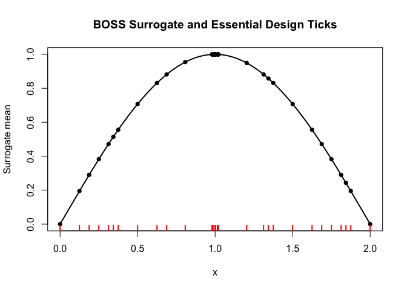
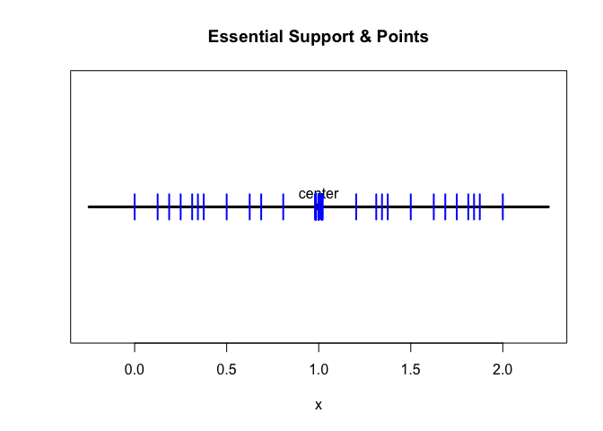
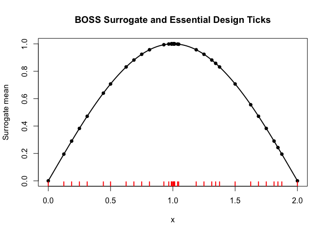
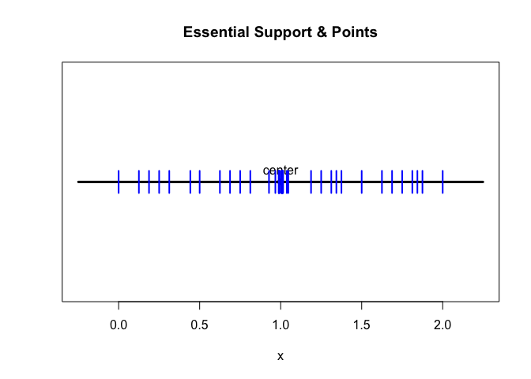
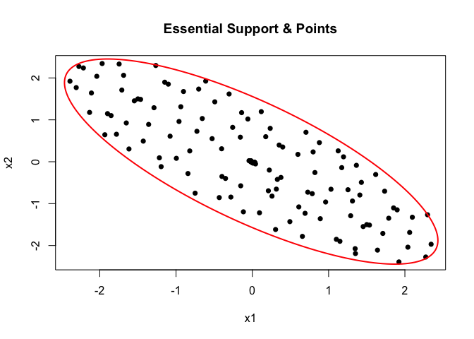
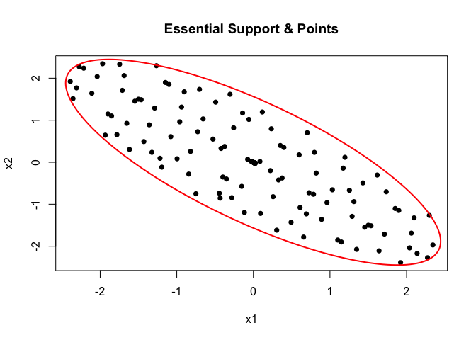

<!-- README.md is generated from README.Rmd. Please edit that file -->

# BOSS

<!-- badges: start -->

<!-- badges: end -->

The goal of BOSS is to perform scalable approximate Bayesian inference
for complex hierarchical models, with a (log) marginal likelihood that
is intractable and/or expensive to compute.

## Installation

You can install the development version of BOSS from
[GitHub](https://github.com/) with:

``` r
# install.packages("pak")
pak::pak("davidolohowski/BOSS")
```

## Example

This is a basic example which shows you how to solve a simple problem in
1-D.

Assume the true (log) marginal likelihood is given by the following
sinusoidal function:

``` r
library(BOSS)
f1d <- function(x) sin(0.5*pi*x)
```

We can use the `boss` function to approximate the (log) marginal
likelihood of this function, specifying the objective function, the
dimension of the problem, and the bounds for the BO optimization. The
`alpha` parameter controls the level of the essential support, while `h`
controls the target fill-in distance of the design points.

``` r
# A automatic implementation
br2 <- boss(f1d, D = 1, 
            modal_opts = list(lower = 0, upper = 2),
            alpha = 0.05, h = 0.1, verbose = 1)
#> Stage 1: Bayesian Optimization via Mode-Seeking Surrogate (BOSS) started.
#> Stage 1: BOSS finished.
#> Total time taken: 1.46 seconds.
#> Start updating Hessian at the mode...
#> Hessian updated in  0.01  seconds.
#> Stage 2: Fill-in to target spacing h =  0.1 
#> fill in: added 17 point(s).
#> Final update completed in  0.02  seconds.
plot(br2)
```



For more advanced applications, the user can also manually perform each
step of the BOSS algorithm, as shown below:

``` r
# A manual implementation
br <- BOSS:::BOSS_modal(func = f1d, D = 1,
                        lower = 0, upper = 2,
                        update_step = 5,
                        quad = FALSE,
                        max_iter = 20,
                        verbose = 1)
#> Stage 1: Bayesian Optimization via Mode-Seeking Surrogate (BOSS) started.
#> Stage 1: BOSS finished.
#> Total time taken: 1.14 seconds.
br <- update_hessian(br)
br <- compute_essential_support(br, alpha=0.05)
br <- construct_essential_designs(br)
br <- compute_fill_in(br)
br <- fill_in(br, h = 0.1, verbose = 1, max_add = 100)
#> fill in: added 19 point(s).
br_update <- update_boss(br)
plot(br_update)
```



## 2-D Example

Test the BOSS algorithm on a 2-D Gaussian density. The objective
function here is the log-density of a randomly generated bivariate
Gaussian random variable.

``` r
rho <- runif(1, min = -0.9, 0.9)
f2d <- function(x) mvtnorm::dmvnorm(x, rep(0,2), sigma = matrix(c(1,rho, rho, 1), 2, 2), log = T)

# A automatic implementation
br3 <- boss(f2d, D = 2, 
            modal_opts = list(lower = -c(3,3), upper = c(3,3)),
            alpha = 0.05, h = 0.1, verbose = 1)
#> Stage 1: Bayesian Optimization via Mode-Seeking Surrogate (BOSS) started.
#> Stage 1: BOSS finished.
#> Total time taken: 2.45 seconds.
#> Start updating Hessian at the mode...
#> Hessian updated in  0.01  seconds.
#> Stage 2: Fill-in to target spacing h =  0.1
#> Warning in (function (boss_result, h, max_add = 100, n_sample_max = 10000, :
#> Number of points to be added is greater than max_add. Required h may not be
#> achieved.
#> fill in: added 100 point(s).
#> Warning in (function (boss_result, h, max_add = 100, n_sample_max = 10000, :
#> Updated fill-in distance is (0.423571) > target h (0.100000); Adjust your
#> expectation by either increasing max_add and n_sample_max or increasing h.
#> Final update completed in  0.09  seconds.
plot(br3)
```



Similarly, users can also have more modular control over the procedure:

``` r
br3 <- BOSS:::BOSS_modal(func = f2d, D = 2,
                        lower = -c(3,3), upper = c(3,3),
                        initial_design = 10,
                        quad = TRUE,
                        update_step = 10,
                        max_iter = 100,
                        verbose = 1)
#> Stage 1: Bayesian Optimization via Mode-Seeking Surrogate (BOSS) started.
#> Stage 1: BOSS finished.
#> Total time taken: 6.6 seconds.

br3 <- update_hessian(br3)
br3 <- compute_essential_support(br3, alpha = 0.05)
br3 <- construct_essential_designs(br3)
br3 <- compute_fill_in(br3, n_samples = 100000)
br3 <- fill_in(br3, h = 0.1, max_add = 100)
#> Warning in fill_in(br3, h = 0.1, max_add = 100): Number of points to be added
#> is greater than max_add. Required h may not be achieved.
#> Warning in fill_in(br3, h = 0.1, max_add = 100): Updated fill-in distance is
#> (0.431124) > target h (0.100000); Adjust your expectation by either increasing
#> max_add and n_sample_max or increasing h.
plot(br3)
```



``` r

br3_update <- update_boss(br3)
```

## More efficient surrogate

By default, the current functions `update_boss` and `boss_modal`
construct the `surrogate` function using the function `predict_gp`,
which implies that each evaluation of the surrogate function requires a
full matrix inversion of the covariance matrix. This becomes inefficient
if we want to evaluate the surrogate function at many points.

To improve the efficiency, we can use the `update_boss_faster` function,
which uses pre-computed factorization of the covariance to define the
surrogate function. The `surrogate` function updated by
`update_boss_faster` is much more efficient than the original
`surrogate` function, especially when the number of design points is
large.

``` r
br3_update_faster <- update_boss_faster(br3)
```

``` r
br3_update$surrogate(c(1,1))
#> [1] -5.720378
br3_update_faster$surrogate(c(1,1))
#> [1] -5.720378
```

``` r
compare_runtime <- microbenchmark::microbenchmark(
  br3_update$surrogate(c(1,1)),
  br3_update_faster$surrogate(c(1,1)),
  unit = 'ms',
  times = 1000
)
#> Warning in microbenchmark::microbenchmark(br3_update$surrogate(c(1, 1)), : less
#> accurate nanosecond times to avoid potential integer overflows

compare_runtime
#> Unit: milliseconds
#>                                  expr      min        lq       mean   median
#>         br3_update$surrogate(c(1, 1)) 1.552998 1.6727590 1.85613851 1.714271
#>  br3_update_faster$surrogate(c(1, 1)) 0.079950 0.0855875 0.09662696 0.090487
#>        uq      max neval
#>  1.787313 7.150113  1000
#>  0.097252 2.769140  1000
```
